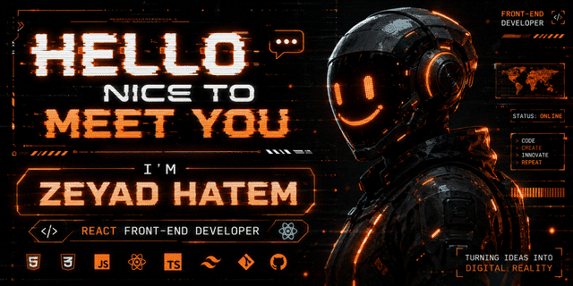

  

# 👋 Hi, I'm Zeyad Hatem

### 🚀 React.js Frontend Developer | AI Student

Turning complex ideas into clean, responsive, and interactive user experiences.

I enjoy building modern web applications with React, creating smooth UI/UX, and continuously learning AI to combine intelligent systems with great frontend experiences.

---

## 💫 About Me

- 💻 Frontend Developer specializing in **React.js**
- 🎨 Passionate about modern UI/UX
- ⚡ Love animations and clean interfaces
- 🤖 AI Student exploring Machine Learning & Deep Learning
- 🌱 Currently learning **TypeScript** and advanced React patterns

---

## 🌐 Connect With Me

---

# 💻 Tech Stack

---

# 📊 GitHub Stats

---

  

  ⭐ If you like my work, consider giving my repositories a star!

